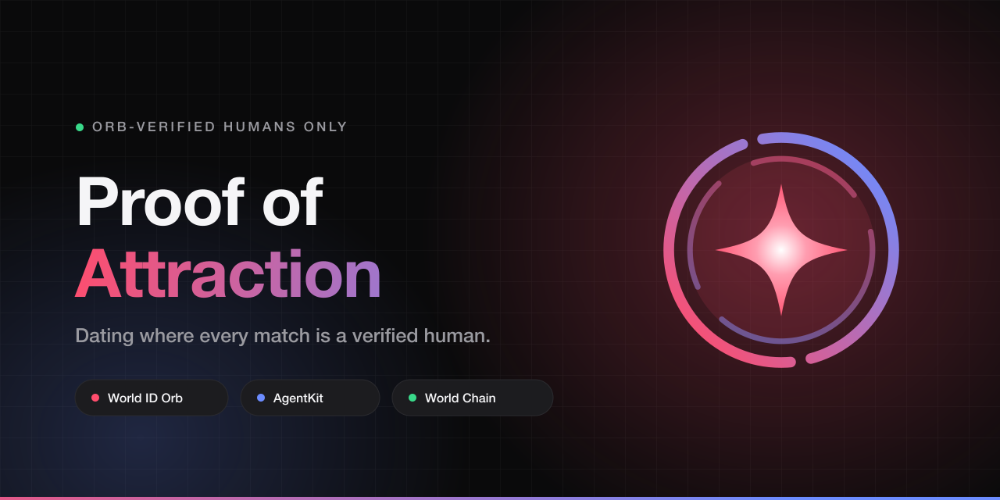

# Proof of Attraction



A React Native dating app for **ETHOnline 2026** where human verification is a first-class trust primitive. Every match, message, and RSVP is gated behind verifiable proof that a real, unique human is behind the screen — powered by **World ID**, **Selfie Check**, and **AgentKit**.

> Orb-verified humans only. No bots, no catfish, no duplicate accounts.

## World Prize Targets

- **AgentKit Continuity ($3,500)** — human-backed AI agent authorization in chat and discovery
- **Selfie Check ($3,500)** — liveness and continuity verification on first message and event RSVP

See [docs/TRACK.md](docs/TRACK.md) for full track submission details.

## How verification works

The app follows World's recommended split between one-time uniqueness and returning-user continuity:

| Purpose | Mechanism | Endpoint |
| --- | --- | --- |
| One-time sign-up (Sybil resistance) | action **nullifier** | `POST /auth/selfie` |
| Returning-user login | **session proof** (`session_id`) | `/auth/session/create`, `/lookup`, `/prove` |
| Liveness + gender estimate | two-frame camera challenge | `POST /me/gender-estimate` |

Because World ID 4.0 nullifiers are **one-time-use**, a World ID can only ever sign up once per action. Re-verifying returns `nullifier_replayed`, which the app treats as "you already have an account" and routes to session login. See [docs/WORLDID_NULLIFIER_REPLAYED.md](docs/WORLDID_NULLIFIER_REPLAYED.md).

## Structure

```
app/                    Expo Router screens
  index.tsx             Onboarding, World ID verify + session login
  gender-estimate.tsx   Live two-frame selfie estimate
  (tabs)/               Discover, Matches, Events, Agent, Profile
  chat/[id].tsx         Chat with Selfie Check gate + agent disclosure
src/
  api/                  Typed backend client
  auth/                 JWT session storage, auto-refresh, AuthContext
  agent/                AgentKit client (EIP-191 signed headers)
  verification/         World ID modal/provider, tiers, gender estimate
  wallet/               Privy embedded wallet, World Chain Sepolia, x402 top-up
  realtime/             Ably channels with token re-authorization
  media/                Photo picker + upload, location capture
  push/                 Expo push registration
  lib/                  App state store
  theme/                Dark-first design tokens
  components/           Shared UI primitives
server/
  src/routes.ts         Domain API (profile, discovery, likes, matches, events)
  src/index.ts          Auth + AgentKit-gated agent routes
  src/matching.ts       Weighted discovery ranking
  src/repo/             Postgres + in-memory repositories
  src/db/               Drizzle schema, client, seeder
  drizzle/              SQL migrations
  scripts/              Reset, seed inspection, maintenance utilities
android/                Expo prebuild native project
docs/                   Track doc, prize feedback, World ID notes
```

## Quick start

### 1. Environment

A **single `.env` at the repo root** serves both the app and the server.

```bash
cp .env.example .env
```

| Variable | Used by | Purpose |
| --- | --- | --- |
| `EXPO_PUBLIC_WORLD_APP_ID` | app | World ID app id (`app_...`) |
| `EXPO_PUBLIC_VERIFY_URL` | app | Hosted verifier page |
| `EXPO_PUBLIC_AGENT_API` | app | Backend base URL |
| `EXPO_PUBLIC_WORLD_ID_ACTION` | app | Sign-up action name |
| `EXPO_PUBLIC_PRIVY_APP_ID` | app | Enables the embedded wallet |
| `RP_ID` / `WORLD_APP_ID` | server | World ID verification |
| `JWT_SECRET` | server | Session signing (**change in prod**) |
| `DATABASE_URL` | server | Neon Postgres (falls back to in-memory) |
| `ABLY_API_KEY` | server | Realtime chat |
| `UPSTASH_REDIS_*` | server | Durable agent quota + nonces |
| `LLM_API_KEY` | server | Agent drafting + gender estimate |

> `EXPO_PUBLIC_*` values are inlined at bundle time — restart Metro (`npx expo start -c`) after changing them.

### 2. Backend

```bash
cd server
npm install
npm run dev          # http://localhost:8787
```

### 3. App

```bash
npm install
npx expo start
```

World ID deep links need a **dev build**, not Expo Go:

```bash
npx expo run:android
npx expo run:ios
```

## Database

```bash
cd server
npm run db:generate    # schema -> migration
npm run db:migrate     # apply migrations
npm run db:seed        # 20 demo profiles + 6 events (idempotent)
```

Seed demo matches and conversations for a signed-up account:

```bash
npm run db:seed -- --matches <your-handle>
```

## Dev utilities

```bash
cd server

npm run reset:all                        # wipe users AND rotate the World action
npm run reset:action                     # rotate the action only
npm run reset -- --handle <handle>       # delete one account

node scripts/inspect-db.mjs              # counts, profiles, events
node scripts/inspect-matches.mjs <handle>
node scripts/inspect-wallets.mjs         # linked wallets
node scripts/inspect-wallets.mjs --clear <handle>
node scripts/dedupe-events.mjs
```

**Wiping the database requires rotating the World ID action** — otherwise the old nullifier is orphaned and that World ID can never sign up again. `reset:all` does both.

## Discovery ranking

`server/src/matching.ts` scores every candidate on six weighted signals:

| Signal | Weight |
| --- | --- |
| Shared interests (Jaccard) | 0.34 |
| Distance (haversine) | 0.14 |
| Verification tier | 0.14 |
| Agent-backed | 0.14 |
| On-chain reputation | 0.12 |
| Age proximity | 0.12 |

On-chain reputation reads the user's linked wallet, which is registered automatically at startup once the account is Orb-verified.

## Stack

- **Mobile** — React Native 0.86, Expo SDK 57, Expo Router, TypeScript
- **Identity** — World ID 4.0 (`developer.world.org/api/v4`), Selfie Check, session proofs
- **Agents** — AgentKit + AgentBook, EIP-191 signed headers, x402 payment gate
- **Wallet** — Privy embedded wallet + viem on World Chain Sepolia (`4801`)
- **Backend** — Node.js + Hono, deployable to Vercel
- **Data** — Neon Postgres + Drizzle ORM, Upstash Redis, Vercel Blob
- **Realtime** — Ably channels, Expo push notifications

## Contact

aloysjehwin@gmail.com

